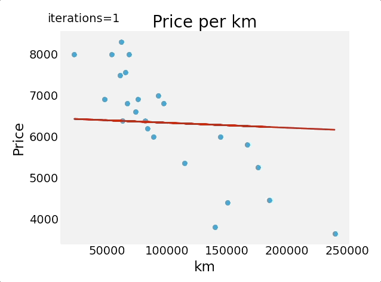

# ft_linear_regression
A simple linear regression model using gradient descent.

After data normalization, parameters are calculated and stored.



## Requirements
* Numpy
* Pandas
* Matplotlib

## Setup
`pip install -r requirements.txt`

## Usage
**Regressor**
```
usage: regressor [-h] [-p] [-a] [-c] [input]

positional arguments:
  input          csv input file

optional arguments:
  -h, --help     show this help message and exit
  -p, --plot     plot the data and the regression line
  -a, --animate  show evolution of regression line across iterations, option
                 -p must be turned on
  -c, --cost     plot evolution of the cost function values across iterations 
```

**Estimator**
```
usage: estimator [-h] [input]

positional arguments:
  input       file containing the theta parameters and regularization values

optional arguments:
  -h, --help  show this help message and exit 
```

The regressor first trains on input data, and then save the optimised thetas parameters into a file.
The estimator reads the parameters from the latter file, and then asks to the user a value to do a prediction on.
